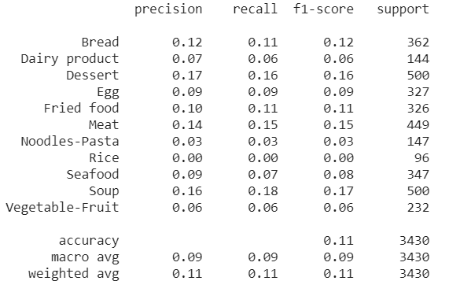
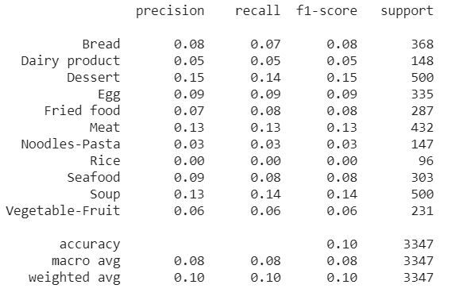
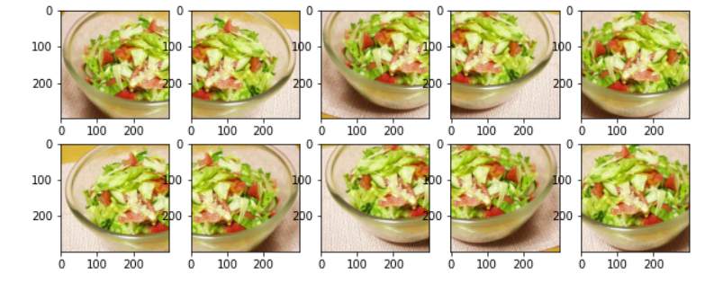

# Food-Classification-with-Deep-Learning
# Food Classification with Deep Learning
## Introduction
### CNN in Computer Vision
###### What is Computer Vision?
Computer Vision is an interdisciplinary field of science that aims to make computers process, analyze images and videos and extract details in the same way a human mind does. Earlier Computer Vision was meant only to mimic human visual systems until we realized how AI can augment its applications and vice versa. We may also not realize this every day but we are being assisted by the applications of Computer Vision in automotive, retail, banking and financial services, healthcare, etc.

###### How CNNs Work?
Most of the Computer Vision tasks are surrounded around CNN architectures, as the basis of most of the problems is to classify an image into known labels. Algorithms for object detection like SSD(single shot multi-box detection) and YOLO(You Only Look Once) are also built around CNN.
</br> 

## Project Description
We present a CNN-based dish detection and score estimation system, running on iOS or android. The proposed app can estimate the score after detecting dishes from the video stream captured from the built-in camera of a Phone. For the deep learning framework, we use Keras (backend TensorFlow) to train and convert the model for CoreML to use it.

###### What is Tensorflow?
TensorFlow is a free and open-source software library for dataflow and differentiable programming across a range of tasks. It is a symbolic math library, and is also used for machine learning applications such as neural networks.

###### what is Keras?
Keras is an open-source neural-network library written in Python. It is capable of running on top of TensorFlow, Microsoft Cognitive Toolkit, R, Theano, or PlaidML. Designed to enable fast experimentation with deep neural networks.

</br> 
## Dataset
We used Food-11 image dataset found in Kaggle <a href="https://www.kaggle.com/vermaavi/food11"> Kaggle Dataset</a></br>

* There are 3 splits in this dataset:
  evaluation </br>
  training </br>
  validation </br>
 * Each split contains 11 categories of food: </br>
  Bread </br>
  Dairy product </br>
  Dessert </br>
  Egg </br>
  Fried food </br>
  Meat </br>
  Noodles-Pasta </br>
  Rice </br>
  Seafood </br>
  Soup </br>
  Vegetable-Fruit </br>
## Approach
We built a system recently for the purpose of experimenting with Deep Learning. The key components are a single NVIDIA Tesla K80 GPU w/12 GB of memory that can be used up to 12 hours continuously offered by Google Colab,25 gb of system RAM.It is running 64-bit Ubuntu 19.04 and using the jupyter notebook Python 3.6 distribution.

## Results
After fine-tuning a pre-trained efficientnet model, I was able to achieve about 86.99% Top-1 Accuracy on the test set using a single crop per item.But when it came to prediction there is a noticed loss.
</br> 
* We have been able to achieve more accurate results with: </br>
  InceptionV3 </br>
  ResNet200 </br>
  WISeR </br>
  

## Thoughts and future improvement
We have spent about 2 months on and off building this project, trying to train dozens of models and exploring various areas such as multiprocessing for faster image augmentation. This is a cleaned up version of the notebook that contains my best performing model as of Sep 14, 2020.</br>
If you have more ressources (in term of ram and GPU) you can replace the dataset with another one which is richer(like FOOD-101 for example) and other different models to get better results. </br>
In the future, We would like to learn how to: </br>

* How to handle larger than RAM datasets in a performant way?
* How to avoid Loading a large amount of data into memory?
* Saving the data into h5py file for out of band processing?
* Improving multiprocessing image augmentation? </br>
Please get in touch if you have any ideas! </br>
## Ressources:
I was inspired by this Keras blog post: <a href="https://blog.keras.io/building-powerful-image-classification-models-using-very-little-data.html" >Building powerful image classification models using very little data </a></br>
and a related script I found on github that belongs to Keras too: <a href="https://keras.io/guides/transfer_learning/">keras-finetuning</a></br>
## Experiment
Since you can not see the results in the jupyter notebook due to its size unless you download it and open it with either anaconda or colab i will put some results below : </br>
### Importing Libraries </br>
Import all of the packages needed
```bash
!pip install -q efficientnet
#Mounting google colab with google drive
from google.colab import drive,files
drive.mount('/content/drive')
#Matplotlib is a comprehensive library for creating static, animated, and interactive visualizations in Python.
import matplotlib.pyplot as plt
import matplotlib.image as img
#Numpy library allows you to perform numerical calculations with Python. It introduces easier management of number tables.
import numpy as np
#inline to get the output graphs on this notebook and not on an external tab
%matplotlib inline
#from scipy.misc import imresize
from PIL import Image
#numpy.array(Image.fromarray(arr).resize())
#This module provides a portable way of using operating system dependent functionality.(to handle a file in  our case)
import os
from os import listdir
from os.path import isfile, join
#The shutil module offers a number of high-level operations on files and collections of files. 
#In particular, functions are provided which support file copying and removal. 
import shutil
import stat
import collections
from collections import defaultdict
#Widgets are eventful python objects that have a representation in the browser, often as a control like a slider, textbox, etc.
from ipywidgets import interact, interactive, fixed
import ipywidgets as widgets
#The h5py package is a Pythonic interface to the HDF5 binary data format.
import h5py
#scikit-learn is a Python module for machine learning built on top of SciPy.
from sklearn.model_selection import train_test_split

#Ps: i have runtime error here 
from keras.utils.np_utils import to_categorical
```
#### Download the dataset and extract it
```bash
import zipfile
#train data
zip_ref = zipfile.ZipFile("/content/drive/My Drive/stageYobitrust2020/examples/Food11/432700_821742_compressed_training.zip", 'r')
zip_ref.extractall("/tmp/traindata")
zip_ref.close()
#We can observe 11 classes of food categories in the traindata folder
!ls /tmp/traindata
```
 </br>
```bash
#visualize the 10 first images of the Meat category of the train data
!ls /tmp/traindata/Meat | head -10
```
 </br>
#### Let's look at some random images from each food class. You can right click and open the image in a new window or save it in order to see it at a higher resolution.</br>

```python
root_dir = '/tmp/traindata/'
rows = 2
cols = 6
fig, ax = plt.subplots(rows, cols, frameon=False, figsize=(15, 25))
fig.suptitle('Random Image from Each Food Class', fontsize=20)
sorted_food_dirs = sorted(os.listdir(root_dir))
for i in range(rows):
    for j in range(cols):
        try:
            food_dir = sorted_food_dirs[i*cols + j]
        except:
            break
        all_files = os.listdir(os.path.join(root_dir, food_dir))
        rand_img = np.random.choice(all_files)
        img = plt.imread(os.path.join(root_dir, food_dir, rand_img))
        ax[i][j].imshow(img)
        ec = (0, .6, .1)
        fc = (0, .7, .2)
        ax[i][j].text(0, -20, food_dir, size=10, rotation=0,
                ha="left", va="top", 
                bbox=dict(boxstyle="round", ec=ec, fc=fc))
plt.setp(ax, xticks=[], yticks=[])
plt.tight_layout(rect=[0, 0.03, 1, 0.95])
```
 </br>
 </br>
#### A multiprocessing.Pool will be used to accelerate image augmentation during training.

```python
# Setup multiprocessing pool
# Do this early, as once images are loaded into memory there will be Errno 12
# http://stackoverflow.com/questions/14749897/python-multiprocessing-memory-usage
import multiprocessing as mp
num_processes = 6
pool = mp.Pool(processes=num_processes)
```
We need maps from class to index and vice versa, for proper label encoding and pretty printing.
```
class_to_ix = {}
ix_to_class = {}
with open('/content/drive/My Drive/stageYobitrust2020/examples/Food11/classes.txt', 'r') as txt:
    classes = [l.strip() for l in txt.readlines()]
    class_to_ix = dict(zip(classes, range(len(classes))))
    ix_to_class = dict(zip(range(len(classes)), classes))
    class_to_ix = {v: k for k, v in ix_to_class.items()}
sorted_class_to_ix = collections.OrderedDict(sorted(class_to_ix.items()))
print(sorted_class_to_ix)
```
 </br>
```
#test data
zip_ref = zipfile.ZipFile("/content/drive/My Drive/stageYobitrust2020/examples/Food11/432700_821742_compressed_evaluation.zip", 'r')
zip_ref.extractall("/tmp/testdata")
zip_ref.close()
#validation data
zip_ref = zipfile.ZipFile("/content/drive/My Drive/stageYobitrust2020/examples/Food11/432700_821742_compressed_validation.zip", 'r')
zip_ref.extractall("/tmp/validationdata")
zip_ref.close()
trainPath = '/tmp/traindata'
validPath = '/tmp/validationdata'
testPath  = '/tmp/testdata'
ls /tmp
```

 </br>

```
import os
Foods = os.listdir(trainPath)
Foods.sort()
print(Foods)
labels = Foods
```
 </br>
#### Prepare Data

```
#a highly optimized library for numerical operations with a MATLAB-style syntax.
import numpy as np
#pip install opencv-python
#OpenCV-Python is a library of Python bindings designed to solve computer vision problems.
import cv2
#Converts a class vector (integers) to binary class matrix.
from tensorflow.keras.utils import to_categorical
```

#### Visualization Tools / Visualize original Data
We are now ready to load the training and testing images into memory. After everything is loaded, Any images that have a width or length smaller than min_size will be resized. This is so that we can take proper-sized crops during image augmentation.

```
@interact(n=(0, len(X_test)))
def show_pic(n):
    plt.imshow(X_test[n])
    print('class:', y_test[n], ix_to_class[y_test[n]]) 
```
 </br>

```
@interact(n_class=sorted_class_to_ix)
def show_random_images_of_class(n_class=0):
    print(n_class)
    nrows = 4
    ncols = 8
    fig, axes = plt.subplots(nrows=nrows, ncols=ncols)
    fig.set_size_inches(12, 8)
    #fig.tight_layout()
    imgs = np.random.choice((y_train == n_class).nonzero()[0], nrows * ncols)
    for i, ax in enumerate(axes.flat):
        im = ax.imshow(X_train[imgs[i]])
        ax.set_axis_off()
        ax.title.set_visible(False)
        ax.xaxis.set_ticks([])
        ax.yaxis.set_ticks([])
        for spine in ax.spines.values():
            spine.set_visible(False)
    plt.subplots_adjust(left=0, wspace=0, hspace=0)
    plt.show()
```
 </br>
```
@interact(n_class=sorted_class_to_ix)
def show_random_images_of_class(n_class=0):
    print(n_class)
    nrows = 4
    ncols = 8
    fig, axes = plt.subplots(nrows=nrows, ncols=ncols)
    fig.set_size_inches(12, 8)
    #fig.tight_layout()
    imgs = np.random.choice((y_test == n_class).nonzero()[0], nrows * ncols)
    for i, ax in enumerate(axes.flat):
        im = ax.imshow(X_test[imgs[i]])
        ax.set_axis_off()
        ax.title.set_visible(False)
        ax.xaxis.set_ticks([])
        ax.yaxis.set_ticks([])
        for spine in ax.spines.values():
            spine.set_visible(False)
    plt.subplots_adjust(left=0, wspace=0, hspace=0)
    plt.show()
```
 </br>
#### Data Augmentation
Having a large dataset is crucial for the performance of the deep learning model. However, we can improve the performance of the model by augmenting the data we already have.
</br>
In our case we will use keras ImageDataGeerator package.While the word “augment” means to make something “greater” or “increase” something (in this case, data), the Keras ImageDataGenerator class actually works by:
</br>
1-Accepting a batch of images used for training.
</br>
2-Taking this batch and applying a series of random transformations to each image in the batch (including random rotation, resizing, shearing, etc.).
</br>
3-Replacing the original batch with the new, randomly transformed batch.
</br>
4-Training the CNN on this randomly transformed batch (i.e., the original data itself is not used for training).
</br>
```
#ImageDataGenerator Generate batches of tensor image data with real-time data augmentation.
#The data will be looped over (in batches).
from tensorflow.keras.preprocessing.image import ImageDataGenerator, array_to_img, img_to_array, load_img
target_size=(224,224)
batch_size = 16
train_datagen = ImageDataGenerator(
    rescale=1./255,
    rotation_range=30,
    width_shift_range=0.2,
    height_shift_range=0.2,
    shear_range=0.15,
    zoom_range=0.15,
    horizontal_flip=True)

train_generator = train_datagen.flow_from_directory(
    trainPath,
    target_size=target_size,
    batch_size=batch_size,
    color_mode='rgb',    
    shuffle=True,
    seed=42,
    class_mode='categorical')
```
 </br>
```
valid_datagen = ImageDataGenerator(rescale=1./255)

valid_generator = valid_datagen.flow_from_directory(
    validPath,
    target_size=target_size,
    batch_size=batch_size,
    color_mode='rgb',
    class_mode='categorical')
```
 </br>
```
test_datagen = ImageDataGenerator(rescale=1./255)

test_generator = test_datagen.flow_from_directory(
    testPath,
    target_size=target_size,
    batch_size=batch_size,
    color_mode='rgb',    
    class_mode='categorical')
```
 </br>

#### Build Model
```
import tensorflow as tf
import tensorflow.keras as keras
from tensorflow.keras.applications.vgg16 import VGG16
from tensorflow.keras.models import Model
from tensorflow.keras.layers import Conv2D, MaxPooling2D, Flatten, Dense, Dropout, GlobalAveragePooling2D
from tensorflow.keras.layers import Input, BatchNormalization, Activation, LeakyReLU, Concatenate
from tensorflow.keras.regularizers import l2
from tensorflow.keras.callbacks import ModelCheckpoint
from sklearn.metrics import classification_report, confusion_matrix
import efficientnet.tfkeras as efn
from google.colab import drive
drive.mount('/content/drive')
```

```
num_classes = 11
input_shape = (224,224,3)
# Build Model
net = efn.EfficientNetB7(input_shape=input_shape, weights='imagenet', include_top=False)

# add two FC layers (with L2 regularization)
x = net.output
x = GlobalAveragePooling2D()(x)

x = Dense(256)(x)
x = Dense(32)(x)

# Output layer
out = Dense(num_classes, activation="softmax")(x)

model = Model(inputs=net.input, outputs=out)
model.summary()
```
 </br>
#### Train Model
We will be retraining an efficientnet model, pretrained on ImageNet. The neural network architecture is shown below.
 </br>
```
num_train = 9866
num_valid = 3430
#here we choose to work with 11 epochs because it gives us the best results according to the accuracy and loss graphs as shown below
num_epochs= 11
# Train Model
history = model.fit_generator(train_generator,steps_per_epoch=num_train // batch_size,epochs=num_epochs, validation_data=valid_generator, validation_steps=num_valid // batch_size) #, callbacks=[checkpoint])
```
 </br>
```
# Plot training & validation accuracy values
plt.plot(history.history['accuracy'], marker="o")
plt.plot(history.history['val_accuracy'], marker="o")
plt.title('Model accuracy')
plt.ylabel('Accuracy')
plt.xlabel('Epoch')
plt.legend(['Train', 'Test'], loc='upper left')
plt.show()
# Plot training & validation loss values
plt.plot(history.history['loss'], marker="o")
plt.plot(history.history['val_loss'], marker="o")
plt.title('Model loss')
plt.ylabel('Loss')
plt.xlabel('Epoch')
plt.legend(['Train', 'Test'], loc='upper')
```
 </br>
 </br>
#### Save Model
```
## Save Model
model.save('food11.h5')

```

#### Evaluate Model
At this point, we should have multiple trained models saved to disk. We can go through them and use the load_model function to load the model with the lowest loss / highest accuracy.
```
score = model.evaluate(valid_generator)
```
 </br>
#### Confusion Matrix (validation set)
A confusion matrix will plot each class label and how many times it was correctly labeled vs. the other times it was incorrectly labeled as a different class.
```
predY=model.predict(valid_generator)
y_pred = np.argmax(predY,axis=1)
#y_label= [labels[k] for k in y_pred]
y_actual = valid_generator.classes
cm = confusion_matrix(y_actual, y_pred)
print(cm)

```
 </br>

```
print(classification_report(y_actual, y_pred, target_names=labels))
```
 </br>
#### Test Model

```
score = model.evaluate(test_generator)
```
 </br>
#### Confusion Matrix (test set)
```
predY=model.predict(test_generator)
y_pred = np.argmax(predY,axis=1)
#y_label= [labels[k] for k in y_pred]
y_actual = test_generator.classes
cm = confusion_matrix(y_actual, y_pred)
print(cm)
```

 </br>
```
print(classification_report(y_actual, y_pred, target_names=labels))
```
 </br>
We also want to evaluate the test set using multiple crops. This can yield an accuracy boost of 5% compared to single crop evaluation. It is common to use the following crops: Upper Left, Upper Right, Lower Left, Lower Right, Center. We also take the same crops on the image flipped left to right, creating a total of 10 crops.
</br>
In addition, we want to return the top-N predictions for each crop in order to calculate Top-5 accuracy, for instance.
```
def center_crop(x, center_crop_size, **kwargs):
    centerw, centerh = x.shape[0]//2, x.shape[1]//2
    halfw, halfh = center_crop_size[0]//2, center_crop_size[1]//2
    return x[centerw-halfw:centerw+halfw+1,centerh-halfh:centerh+halfh+1, :]
```
```
def predict_10_crop(img, ix, top_n=5, plot=False, preprocess=True, debug=False):
    flipped_X = np.fliplr(img)
    crops = [
        img[:299,:299, :], # Upper Left
        img[:299, img.shape[1]-299:, :], # Upper Right
        img[img.shape[0]-299:, :299, :], # Lower Left
        img[img.shape[0]-299:, img.shape[1]-299:, :], # Lower Right
        center_crop(img, (299, 299)),
        
        flipped_X[:299,:299, :],
        flipped_X[:299, flipped_X.shape[1]-299:, :],
        flipped_X[flipped_X.shape[0]-299:, :299, :],
        flipped_X[flipped_X.shape[0]-299:, flipped_X.shape[1]-299:, :],
        center_crop(flipped_X, (299, 299))
    ]
    if preprocess:
        crops = [preprocess_input(x.astype('float32')) for x in crops]

    if plot:
        fig, ax = plt.subplots(2, 5, figsize=(10, 4))
        ax[0][0].imshow(crops[0])
        ax[0][1].imshow(crops[1])
        ax[0][2].imshow(crops[2])
        ax[0][3].imshow(crops[3])
        ax[0][4].imshow(crops[4])
        ax[1][0].imshow(crops[5])
        ax[1][1].imshow(crops[6])
        ax[1][2].imshow(crops[7])
        ax[1][3].imshow(crops[8])
        ax[1][4].imshow(crops[9])
    
    y_pred = model.predict(np.array(crops))
    preds = np.argmax(y_pred, axis=1)
    top_n_preds= np.argpartition(y_pred, -top_n)[:,-top_n:]
    if debug:
        print('Top-1 Predicted:', preds)
        print('Top-5 Predicted:', top_n_preds)
        print('True Label:', y_test[ix])
    return preds, top_n_preds

    

```
```
ix = 32
predict_10_crop(X_test[ix], ix, top_n=5, plot=True, preprocess=False, debug=True)
```
 </br>
We also need to preprocess the images for the Efficientnet model:
```
from efficientnet.tfkeras import preprocess_input
ix = 32
predict_10_crop(X_test[ix], ix, top_n=5, plot=True, preprocess=True, debug=True)
```
 </br>
Now we create crops for each item in the test set and get the predictions. This is a slow process at the moment as I am not taking advantage of multiprocessing or other types of parallelism.
```
%%time
preds_10_crop = {}
for ix in range(len(X_test)):
    if ix % 1000 == 0:
        print(ix)
    preds_10_crop[ix] = predict_10_crop(X_test[ix], ix)
```
 </br>
We now have a set of 10 predictions for each image. Using a histogram, I'm able to see how the # of unique predictions for each image are distributed.

```
preds_uniq = {k: np.unique(v[0]) for k, v in preds_10_crop.items()}
preds_hist = np.array([len(x) for x in preds_uniq.values()])

plt.hist(preds_hist, bins=11)
plt.title('Number of unique predictions per image')
```
 </br>

Let's create a dictionary to map test item index to its top-1 / top-5 predictions.
```
preds_top_1 = {k: collections.Counter(v[0]).most_common(1) for k, v in preds_10_crop.items()}

top_5_per_ix = {k: collections.Counter(preds_10_crop[k][1].reshape(-1)).most_common(5) 
                for k, v in preds_10_crop.items()}
preds_top_5 = {k: [y[0] for y in v] for k, v in top_5_per_ix.items()}
%%time
right_counter = 0
for i in range(len(y_test)):
    guess, actual = preds_top_1[i][0][0], y_test[i]
    if guess == actual:
        right_counter += 1
        
print('Top-1 Accuracy, 10-Crop: {0:.2f}%'.format(right_counter / len(y_test) * 100))
```
 </br>


```
%%time
top_5_counter = 0
for i in range(len(y_test)):
    guesses, actual = preds_top_5[i], y_test[i]
    if actual in guesses:
        top_5_counter += 1
        
print('Top-5 Accuracy, 10-Crop: {0:.2f}%'.format(top_5_counter / len(y_test) * 100))
```
 </br>
#### Results Visualization
```
y_pred = [x[0][0] for x in preds_top_1.values()]
@interact(page=[0, int(len(X_test)/20)])
def show_images_prediction(page=0):
    page_size = 20
    nrows = 4
    ncols = 5
    fig, axes = plt.subplots(nrows=nrows, ncols=ncols, figsize=(12, 12))
    fig.set_size_inches(12, 8)
    #fig.tight_layout()
    #imgs = np.random.choice((y_all == n_class).nonzero()[0], nrows * ncols)
    start_i = page * page_size
    for i, ax in enumerate(axes.flat):
        im = ax.imshow(X_test[i+start_i])
        ax.set_axis_off()
        ax.title.set_visible(False)
        ax.xaxis.set_ticks([])
        ax.yaxis.set_ticks([])
        for spine in ax.spines.values():
            spine.set_visible(False)
        predicted = ix_to_class[y_pred[i+start_i]]
        match = predicted ==  ix_to_class[y_test[start_i + i]]
        ec = (1, .5, .5)
        fc = (1, .8, .8)
        if match:
            ec = (0, .6, .1)
            fc = (0, .7, .2)
        # predicted label
        ax.text(0, 400, 'P: ' + predicted, size=10, rotation=0,
            ha="left", va="top",
             bbox=dict(boxstyle="round",
                   ec=ec,
                   fc=fc,
                   )
             )
        if not match:
            # true label
            ax.text(0, 480, 'A: ' + ix_to_class[y_test[start_i + i]], size=10, rotation=0,
                ha="left", va="top",
                 bbox=dict(boxstyle="round",
                       ec=ec,
                       fc=fc,
                       )
                 )
    plt.subplots_adjust(left=0, wspace=1, hspace=0)
    plt.show()
```
 </br>
A confusion matrix will plot each class label and how many times it was correctly labeled vs. the other times it was incorrectly labeled as a different class.
```
%%time
from sklearn.metrics import confusion_matrix
import itertools


def plot_confusion_matrix(cm, classes,
                          normalize=False,
                          title='Confusion matrix',
                          cmap=plt.cm.Blues):
    """
    This function prints and plots the confusion matrix.
    Normalization can be applied by setting `normalize=True`.
    """
    plt.imshow(cm, interpolation='nearest', cmap=cmap)
    plt.title(title)
    plt.colorbar()
    tick_marks = np.arange(len(classes))
    plt.xticks(tick_marks, classes, rotation=90)
    plt.yticks(tick_marks, classes)

    if normalize:
        cm = cm.astype('float') / cm.sum(axis=1)[:, np.newaxis]
        print("Normalized confusion matrix")
    else:
        print('Confusion matrix, without normalization')

    print(cm)

    thresh = cm.max() / 2.
    for i, j in itertools.product(range(cm.shape[0]), range(cm.shape[1])):
        plt.text(j, i, cm[i, j],
                 horizontalalignment="center",
                 color="white" if cm[i, j] > thresh else "black")

    plt.tight_layout()
    plt.ylabel('True label')
    plt.xlabel('Predicted label')
    

# Compute confusion matrix
cnf_matrix = confusion_matrix(y_test, y_pred)
np.set_printoptions(precision=2)

class_names = [ix_to_class[i] for i in range(11)]

plt.figure()
fig = plt.gcf()
fig.set_size_inches(32, 32)
plot_confusion_matrix(cnf_matrix, classes=class_names,
                      title='Confusion matrix, without normalization',
                      cmap=plt.cm.cool)
plt.show()
```
 </br>
We want to see if the accuracy was consistent across all classes, or if some classes were much easier / harder to label than others. According to our plot, a few classes were outliers in terms of being much more difficult to label correctly.
```
corrects = collections.defaultdict(int)
incorrects = collections.defaultdict(int)
for (pred, actual) in zip(y_pred, y_test):
    if pred == actual:
        corrects[actual] += 1
    else:
        incorrects[actual] += 1

class_accuracies = {}
for ix in range(11):
    class_accuracies[ix] = corrects[ix]/250

plt.hist(list(class_accuracies.values()), bins=20)
plt.title('Accuracy by Class histogram')
```
 </br>
```
sorted_class_accuracies = sorted(class_accuracies.items(), key=lambda x: -x[1])
[(ix_to_class[c[0]], c[1]) for c in sorted_class_accuracies]
```
 </br>
#### Interactive Classification
Predicting from a local file
```
import matplotlib.image as img
pic_path = 'sp.jpg'
pic = img.imread(pic_path)
preds = predict_10_crop(np.array(pic), 0)[0]
best_pred = collections.Counter(preds).most_common(1)[0][0]
print(ix_to_class[best_pred])
plt.imshow(pic)
```
 </br>
Predicting from an image on the Internet
```
import urllib.request

@interact
def predict_remote_image(url='https://img.cuisineaz.com/610x610/2016-07-29/i84653-spaghettis-bolognaise-rapides.jpg'):
    with urllib.request.urlopen(url) as f:
        pic = plt.imread(f, format='jpg')
        preds = predict_10_crop(np.array(pic), 0)[0]
        best_pred = collections.Counter(preds).most_common(1)[0][0]
        print(ix_to_class[best_pred])        
        plt.imshow(pic)
```
 </br>
```
```
